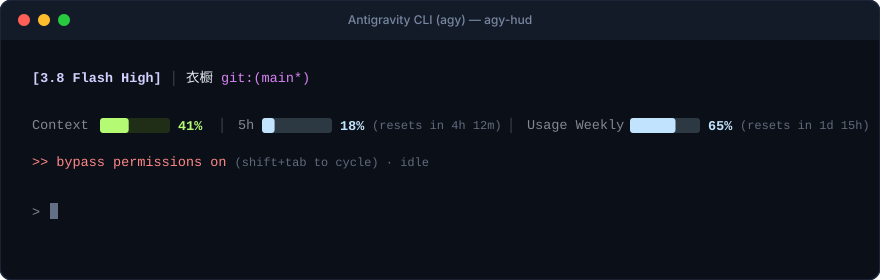

<div align="center">

# 🪶 agy-hud

**A sleek, seamless pastel HUD statusline for Google Antigravity CLI (`agy`).**

[](LICENSE)
[](https://www.python.org/downloads/)
[]()
[-success.svg)]()
[]()

<br>

<p align="center">
  
</p>

[English](#-english) • [中文说明](#-中文说明) • [Quick Install](#-one-liner-installation) • [Comparison](#-why-agy-hud)

</div>

---

## ⚡ One-Liner Installation

Install directly with a single command (works out of the box, zero dependencies):

```bash
curl -fsSL https://raw.githubusercontent.com/MaxHaiCom/agy-hud/main/install.py | python3
```

> **Manual / Git Clone Method**:
> ```bash
> git clone https://github.com/MaxHaiCom/agy-hud.git
> cd agy-hud && python3 install.py
> ```

---

## 🌟 Why agy-hud?

Most terminal statuslines either overwhelm your screen with eye-straining neon colors, or rely on private Nerd Font glyphs that turn into broken square boxes (``) on standard terminals.

**`agy-hud`** brings the restrained, premium **Apple / Linear design system** to the Google Antigravity CLI:

| Feature | `agy-hud` | Default `agy` | Other AGY Statuslines |
| :--- | :---: | :---: | :---: |
| **Solid Seamless Progress Bars** | **✅ 100% Contiguous (Zero Gap Lines)** | ❌ None | ❌ Fragmented character gaps (`█░`) |
| **Multi-Window Quota Sync** | **✅ Cross-Process Shared Cache** | ❌ Process-Isolated (Stale Gauges) | ❌ None |
| **Design Aesthetic** | **✅ Linear & Apple Pastel** | ❌ Monochrome | ❌ Cluttered neon & emoji spam |
| **Dual-Pool Quota Tracking** | **✅ Real-time 5h & Weekly Used %** | ⚠️ Hidden in `/usage` | ⚠️ Inaccurate / Remaining % |
| **Live Reset Countdown** | **✅ Precision Timers (`resets in 4h 12m`)** | ❌ None | ⚠️ Static or absent |
| **Permission / Bypass Indicator** | **✅ Visible (`>> bypass permissions on`)** | ❌ Not in statusline | ❌ Missing |
| **Font Portability** | **✅ 100% Universal (No Nerd Font required)** | ✅ Universal | ❌ Requires patched Nerd Fonts |
| **Zero External Dependencies** | **✅ Pure Python 3 Stdlib** | ✅ Native | ❌ Requires `jq`, Node.js, etc. |

---

## 🎨 Design Principles

1. **Subtle Pastel Tiers**: Muted, calming tones designed for long coding sessions:
   - **Context**: Fresh Lime (`#b4fa72`) on Dark Olive track (`#202d17`).
   - **Quota Usage**: Baby Blue (`#c1e3fe`) on Dark Slate track (`#2c3943`).
   - **Model & Git**: Soft Lavender (`#d0d1fe`) & Orchid (`#d982f5`).
   - **Smart Warning Escalation**: Automatically shifts to Warm Amber (`≥ 75%`) and Coral Red (`≥ 90%`) when limits approach.
2. **Seamless Block Engine**: Renders progress bars using ANSI 24-bit background colors on space cells. This completely eliminates the vertical seam lines common in Unicode block characters (`█`).
3. **Usage-Centric Gauges**: Meters represent **consumed percentage** (filling left-to-right as you work), matching modern intuition and `claude-hud`.

---

## 🔧 CLI Commands & Controls

Inside an interactive `agy` session, you can toggle or manage the statusline anytime:

```text
/statusline              Toggle statusline on/off
/statusline on           Enable statusline
/statusline off          Disable statusline
/statusline delete       Revert to Antigravity's built-in default
/statusline help         Show Antigravity statusline help
```

To preview without opening Antigravity:
```bash
python3 statusline.py --preview
```

To uninstall and restore your previous configuration:
```bash
python3 uninstall.py
```

---

<br>

## 🇨🇳 中文说明

专为 **Google Antigravity CLI (`agy`)** 打造的极简克制、无缝浅色调（Pastel）HUD 状态行。

### 🌟 核心特色

- 🎨 **Apple & Linear 浅色调质感**：告别高饱和荧光刺眼配色，采用柔和浅嫩绿、婴儿浅蓝、薰衣草浅紫，长时间编码不疲劳。
- 🧊 **彻底消灭细线缝隙（纯色无缝进度条）**：利用 ANSI 24-bit 背景色在空格上渲染，**彻底根除了传统字符进度条的竖条细线缝隙**，在 Warp、iTerm2、Ghostty、Kitty 等终端呈现完全一体的圆润色块。
- 📊 **额度使用率（Used %）与精确倒计时**：
  - 进度条自左向右增长，直观反应额度消耗；
  - 超过 `75%` 自动切换暖黄预警，超过 `90%` 切换珊瑚红；
  - 附带精确重置时间：`5h 18% (resets in 4h 12m)`、`Usage Weekly 65% (resets in 1d 15h)`；
  - 自动适配 Google Gemini 专属池与 Claude/GPT 第三方双池模型。
- 🔄 **跨终端窗口配额实时共享同步**：
  - 原生 `agy` 在长任务（`working`）或节流时只更新本地 Context，配额容易卡在历史旧值；
  - `agy-hud` 内置轻量跨进程原子共享缓存，任一窗口拉取到最新配额或重置周期，其余并发/长任务窗口下一次重绘时立即同步最新真值，消灭进程信息孤岛。
- 🛡️ **当前模式与权限常驻感知**：直观展示 `>> bypass permissions on`、`sandbox mode` 或 `strict` 状态，避免因授权卡壳中断思路。
- 🪶 **零外部依赖**：基于纯 Python 3 标准库，无外部子进程拖拽，毫秒级快速启动。
- 🔤 **无需专用 Nerd Font 补丁字体**：不使用私有特殊符号，任何默认终端字体均可完美呈现，绝不出现豆腐块乱码。

### ⚡ 极速一键安装

在终端直接运行：

```bash
curl -fsSL https://raw.githubusercontent.com/MaxHaiCom/agy-hud/main/install.py | python3
```

卸载恢复原状：
```bash
python3 uninstall.py
```

---

## 📄 License

[MIT License](LICENSE) © 2026 MaxHaiCom
